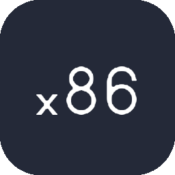

# ✈️ Valentin Massonnière (TheVal)

**`Full Stack Developer (Currently interning at Adloox/Scope3)`**
 
 

Hello! 👋 My name is Valentin MASSONNIÈRE, and I am passionate about technology and video games 🎮💻. Currently pursuing a *Bachelor's degree in Application Design and Development*, I am completing my journey as an apprentice at Adloox/Scope3, where I work on back-end development with Python 🐍. I'm a web developpement hater 🤡.

In the long term, I aspire to pursue a *Master’s degree in Embedded Systems*, a field that deeply fascinates me, particularly in industries such as aerospace, aviation, and robotics 🚀.

---

### 🧰 Languages and Tools

 
 

---

### 📂 Notable Projects

- [**Ollama AI Chat Interface**](https://github.com/TheValll/Ollama-AI-Chat-Interface): 🧠 A web interface for chatting with AI using various models compatible with the Ollama API.
- [**KeyOverlay App**](https://github.com/TheValll/KeyOverlay): 🎮 A basic *Elden Ring* KeyOverlay designed for OBS.
- [**BobOs (currently in development)**](https://github.com/TheValll/BobOs): ⚙️ BobOs is an operating system project based on Assembly and C, developed as part of my final master’s project in embedded systems.
